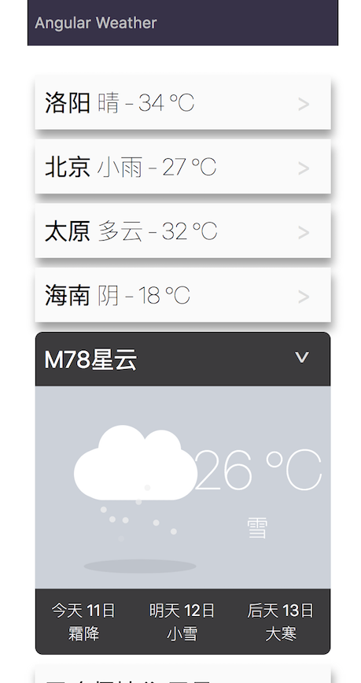

# Angular-Weather

这是一个用`angular@4.3`制作的天气类web app。

天气数据的接口用了"**肥肠不友好的**"**免费版**[心知天气API](https://www.seniverse.com/doc)。

另外还搭建了一个简单的后端服务器来解决请求数据时的前端跨域问题，即`./cross-origin-server.js`。

天气动画特效借鉴自：https://codepen.io/EvanWieland/pen/PwOKLE 。

## 在线预览地址：http://juniortour.net:4201/

[Angular-Weather](http://juniortour.net:4201/)


手机扫一扫预览：


## 图片预览


## To-do
0. 环境配置
1. 考虑使用`Observable.zip`
2. ......

## 本地启动方法：
```
git clone https://github.com/JuniorTour/angular-weather.git

cd angular-weather

cnpm i

ng s  // 开发环境下以 angular-cli 启动

npm run build-prod  // 生产环境打包

npm run prod  // 生产环境下编译打包后在 localhost:4201 启动

```

### 欢迎各种交流～～～
